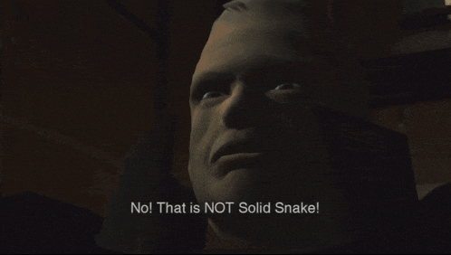

# 🐍 No, That's Not Solid Snake!

A meme-powered machine learning project that answers one simple question:

**“Is this Solid Snake?”**

Inspired by the classic Metal Gear meme, this project trains a computer vision model to identify whether an image contains Solid Snake or not.  
If it’s him, the model proudly says: **“Yes! That’s Solid Snake!”**  
Otherwise: **“No! That’s NOT Solid Snake!”**




---

## 📖 Project Overview
- **Type of problem**: Binary Image Classification  
- **Classes**:
  - `solid_snake` → images of Solid Snake  
  - `not_solid_snake` → everything else (Big Boss, Venom Snake, Old Snake, Raiden, or even random characters like Shrek or Pikachu, if you want to keep the meme alive)

The project follows the **CRISP-DM methodology**, adapted for fun:
1. Business Understanding → turn a meme into a classifier.
2. Data Understanding → collect images of Solid Snake vs. not Solid Snake.
3. Data Preparation → resize, normalize, and augment images.
4. Modeling → use transfer learning (e.g., ResNet, MobileNet) with a sigmoid output.
5. Evaluation → check accuracy, precision, recall, F1-score.
6. Deployment → expose as an API or a small web demo.

---

## 📂 Dataset Structure
Your dataset should follow this structure:
dataset/
├── train/
│ ├── solid_snake/
│ └── not_solid_snake/
├── val/
│ ├── solid_snake/
│ └── not_solid_snake/
└── test/
├── solid_snake/
└── not_solid_snake/


---

## ⚙️ Installation
This project uses [uv](https://github.com/astral-sh/uv) for package management.

```bash
# Clone the repository
git clone https://github.com/leonardo-pais/nothatsnotsolidsnake.git
cd nothatsnotsolidsnake

# If the repo already has pyproject.toml
uv install

# If starting from scratch
uv init
```

## 🚀 Usage

Once trained, you can run inference on any image:

```python
from model import predict_snake

result = predict_snake("example.jpg")

if result:
    print("Yes, that's Solid Snake.")
else:
    print("No, that's not Solid Snake.")
```

## 📊 Evaluation Metrics

Accuracy → general performance.

Precision → of all times it said “Solid Snake,” how many were true?

Recall → of all actual Solid Snake images, how many did it detect?

F1-score → balance between precision and recall.

## 🎮 Future Ideas

Extend to multiclass classification: identify each version of Snake (Solid, Naked, Old, Venom, etc.).

Build a meme-generator web app where users upload any image and get the model’s response.

Deploy as a Discord bot for fans to play with.

## 🐍 Acknowledgements

Inspired by the “No, that’s not Solid Snake” meme.

Metal Gear Solid and its characters belong to Konami. This project is purely for fun and educational purposes.